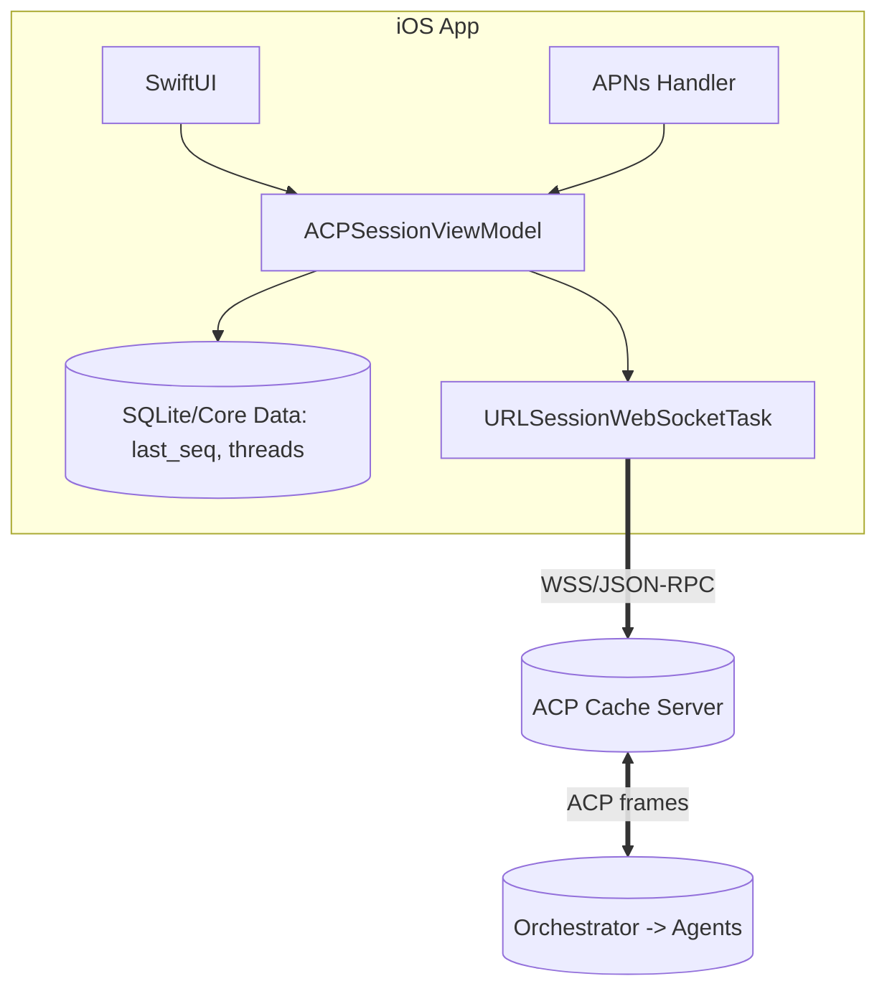

# Mobile Client Architecture — iOS ACP Client with APNs + WSS and Replay/Tail

This document defines the iOS mobile client architecture for RAT’s ecosystem. It focuses on:
- Foreground duplex streaming over WSS to the ACP Cache Server
- Background awareness and wake-ups via Apple Push Notification service (APNs)
- Resumable, at-least-once delivery using ACP-preserving replay-then-tail (subscribe/fetch/ack)
- Security, performance, and operational practices for mobile constraints

Scope: iOS Swift/SwiftUI client. Android is out of scope for this document.

---

## Objectives

- Preserve pure ACP payloads end-to-end (JSON-RPC 2.0), with no mutation at the mobile edge.
- Provide seamless foreground streaming (WSS) and fast resume from the last acked offset.
- Use APNs to nudge users and the app when backgrounded (best-effort) to fetch updates or prompt opening.
- Maintain at-least-once delivery with client-side de-duplication (`seq` + `msg_id`).
- Keep UX fluid: catch-up history renders instantly, then switch to live tail with low added latency.

---

## Architectural Overview

- iOS app connects to ACP Cache Server via WSS; all messages are ACP JSON-RPC 2.0 or cache control RPCs (namespaced `acp.cache.*`).
- Cache persists append-only “envelopes” per `thread_id` with monotonic `seq` and exposes replay API:
  - `acp.cache.subscribe({ thread_id, from_seq, live })`
  - `acp.cache.fetch({ thread_id, from_seq, limit })`
  - `acp.cache.ack({ thread_id, seq })`
- When app is backgrounded:
  - Long-lived sockets are generally not permitted; WSS is closed by the system.
  - APNs (alert or silent) are used to notify users and, when allowed, trigger short background fetch windows to update minimal state.
- Foreground on open:
  - App reads `last_seq` per thread from local store, subscribes from `last_seq + 1`, renders backlog, then live tails.

Mermaid (high level):


---

## Data Contracts

Envelope at cache boundary (persisted form; body is unmodified ACP):
```json
{
  "thread_id": "t-123",
  "session_id": "s-9",
  "seq": 4182,
  "ts": "2025-09-06T20:15:43.512Z",
  "direction": "agent_to_client | client_to_agent",
  "kind": "request | result | notification",
  "jsonrpc": "2.0",
  "body": { /* original ACP JSON-RPC */ },
  "msg_id": "uuid-for-idempotency",
  "checksum": "blake3(body)"
}
```

Cache control API (JSON-RPC 2.0):
```json
{"jsonrpc":"2.0","id":"1","method":"acp.cache.subscribe",
 "params":{"thread_id":"t-123","from_seq":4183,"live":true}}

{"jsonrpc":"2.0","id":"2","method":"acp.cache.fetch",
 "params":{"thread_id":"t-123","from_seq":4200,"limit":500}}

{"jsonrpc":"2.0","id":"3","method":"acp.cache.ack",
 "params":{"thread_id":"t-123","seq":4250}}
```

Client local store:
- threads(thread_id TEXT PRIMARY KEY, title TEXT?, agent TEXT?, last_seq INTEGER NOT NULL DEFAULT 0, unread INTEGER NOT NULL DEFAULT 0)
- envelopes optional rolling cache for snappy UI replay (cap size)
- tokens/refresh handled via Keychain (not in SQLite)

---

## Foreground Transport (WSS)

- Single WSS connection multiplexes cache control and ACP frames.
- Use `URLSessionWebSocketTask`:
  - Auth via Bearer JWT in `Authorization` header.
  - Ping every ~20s; expect pongs (or rely on system defaults).
  - Reconnect with exponential backoff (jittered).
- On connect:
  1) Authenticate with JWT.
  2) For each active thread UI, call `subscribe(from_seq = last_seq + 1, live = true)`.
  3) Render streamed backlog, then flip to live push.
  4) Periodically `ack(seq)` (e.g., every N envelopes or T seconds).
- At-least-once delivery: de-dup using `msg_id` and `seq`. Discard duplicates; advance `last_seq` monotonically.

Swift skeleton (simplified):
```swift
final class ACPClient {
  private var ws: URLSessionWebSocketTask?
  private let session = URLSession(configuration: .default)
  private let decoder = JSONDecoder()
  private let encoder = JSONEncoder()

  func connect(url: URL, jwt: String) {
    var req = URLRequest(url: url)
    req.addValue("Bearer \(jwt)", forHTTPHeaderField: "Authorization")
    ws = session.webSocketTask(with: req)
    ws?.resume()
    receive()
    pingLoop()
  }

  private func receive() {
    ws?.receive { [weak self] result in
      switch result {
      case .failure:
        self?.reconnect()
      case .success(let msg):
        if case .string(let text) = msg {
          self?.handleText(text)
        } else if case .data(let data) = msg, let text = String(data: data, encoding: .utf8) {
          self?.handleText(text)
        }
        self?.receive()
      }
    }
  }

  private func pingLoop() {
    ws?.sendPing { [weak self] _ in
      DispatchQueue.main.asyncAfter(deadline: .now() + 20) { self?.pingLoop() }
    }
  }

  private func reconnect() {
    // exp backoff + subscribe(from_seq=last_seq+1) on reconnect
  }

  func subscribe(threadId: String, fromSeq: Int, live: Bool = true) {
    let req: [String: Any] = [
      "jsonrpc":"2.0","id":UUID().uuidString,"method":"acp.cache.subscribe",
      "params": ["thread_id":threadId,"from_seq":fromSeq,"live":live]
    ]
    if let data = try? JSONSerialization.data(withJSONObject: req),
       let txt = String(data: data, encoding: .utf8) {
      ws?.send(.string(txt)) { _ in }
    }
  }

  func ack(threadId: String, seq: Int) {
    let req: [String: Any] = [
      "jsonrpc":"2.0","id":UUID().uuidString,"method":"acp.cache.ack",
      "params": ["thread_id":threadId,"seq":seq]
    ]
    if let data = try? JSONSerialization.data(withJSONObject: req),
       let txt = String(data: data, encoding: .utf8) {
      ws?.send(.string(txt)) { _ in }
    }
  }

  private func handleText(_ text: String) {
    // Decode as Envelope or JSON-RPC result/notification; update UI/state; persist last_seq
  }
}
```

---

## Background Model + APNs

iOS constraints:
- Long-running WSS in background is not reliable (the OS suspends the app).
- “Silent” remote notifications (`content-available: 1`) are best-effort and subject to power/network conditions.
- Expectation: APNs nudges the app to refresh minimal state OR alerts the user to open the app.

Design:
- The ACP Cache Server emits APNs (via your push provider) when a thread’s head advances and the app is not foregrounded.
- Notification types:
  - Alert push: user-visible; opens the app to foreground (ideal for actionable events).
  - Silent push: `content-available: 1` to trigger short background fetch (no UI); use sparingly. App must enable “Remote notifications” background mode.
- On silent push receipt:
  - If a short background window is granted, call a compact `fetch` to compute “unread counts” or fetch a small page of envelopes for visible threads.
  - Update badge count and local store. Do not attempt long-lived sockets.
- On user tapping an alert push:
  - App opens foreground → resume via WSS subscribe from `last_seq + 1`.

Server to APNs flow:
1) iOS registers for remote notifications and yields a device token.
2) App sends token + user id (or session) securely to the backend.
3) Cache/notification service maps `user_id -> device tokens`.
4) On new envelope at thread head, enqueue push to devices that should be notified (respect preferences).

Silent push payload example:
```json
{
  "aps": { "content-available": 1 },
  "thread_id": "t-123",
  "hint": "inbox_delta"  // optional: the server can include minimal hints
}
```

Recommendations and limits:
- Silent pushes are not guaranteed; do not rely on them for real-time delivery. They are a best-effort nudge.
- Use alert pushes for important events (e.g., “Review diffs ready”).
- Consider coalescing pushes (cooldown/throttle) to reduce noise and preserve deliverability.

---

## Resume & Replay Protocol

- On app launch/foreground:
  - For each thread currently in view or recently active:
    - Read `last_seq`.
    - `subscribe(from_seq = last_seq + 1, live = true)`.
    - Render backlog, set `last_seq = head` as envelopes arrive.
    - Emit `ack(seq)` periodically (windowing).
- De-dup logic:
  - Maintain a per-thread `last_seq` (monotonic).
  - If an envelope arrives with `seq <= last_seq`, skip (duplicate).
  - Optionally track `msg_id` for extra safety.
- Backpressure:
  - If UI falls behind, continue persisting envelopes and update UI in batches.
  - Adjust `fetch(limit)`/stream windows to keep memory bounded.

---

## AuthN / AuthZ

- OIDC with PKCE in-app login (AppAuth-iOS or equivalent).
- Short-lived access tokens kept in memory; refresh tokens in Keychain (biometric-gated as needed).
- JWT audience/issuer validation on the server; TLS enforced (ATS).
- Scopes: `thread:read`, `thread:write`, `terminal:attach`, `tool:run`—validated server-side before serving replay or forwarding ACP.

Certificate pinning (optional, recommended for first-party deployments).

---

## UI Surfaces (ACP-mapped)

- Thread list: title, agent logo, unread (derived from `last_seq` vs head).
- Session view:
  - Stream `session/update`: `agent_message_chunk`, `user_message_chunk`, `agent_thought_chunk` (collapsed), `plan`, `tool_call`, `tool_call_update`.
  - Permission prompts (`session/request_permission`) as modal sheets with options and diff previews.
- Diff review: render unified (MVP), with hunk navigation and large-diff truncation policy.
- Terminal attach (optional, feature-flagged): SwiftTerm-based, read-only by default; explicit “Enable input”.
- Commands palette: driven by `available_commands_update` when present.

Accessibility:
- Colorblind-safe palettes; large text mode; VoiceOver labels for key controls.
- Keyboard shortcuts for iPad with hardware keyboards.

---

## Performance Targets

- Resume-to-head P50 < 200 ms for ≤ 10k events per thread (with snapshotting at cache).
- Added live latency budget by cache ≤ 20 ms P50 over direct connection.
- Minimal memory retention: rolling envelope cache in-app; heavy lifting at server.

Mobile-specific:
- Avoid heavy JSON decoding on main thread; use background queues, then publish on main thread.
- Batch UI state updates (coalesce) under load.
- Respect power/network state; degrade gracefully.

---

## Telemetry & Observability

- Client:
  - Structured logs (redacted) for connect, subscribe, fetch, ack, reconnect attempts.
  - Metrics (dev builds): reconnects, replay time-to-head, envelopes/sec, ack-lag.
  - Crash reporting and non-PII bread crumbs.
- Server:
  - Metrics: events/sec, backlog, replay latency, open sessions, auth failures.
  - Logs/traces around persist → fan-out → client ack.

---

## Testing Strategy

- Contract tests using recorded ACP transcripts (Gemini/Claude Code).
- Network chaos:
  - Drop WSS mid-stream; ensure `subscribe(from_seq=last_seq+1)` resumes cleanly.
  - Introduce duplicate envelopes; confirm de-dup.
- Push integration:
  - Simulate alert and silent notifications; verify background fetch updates unread counts.
- Large content:
  - Oversized diffs/images; enforce truncation; measure UI responsiveness.

---

## Security Considerations

- ATS enforced; avoid exceptions. If LAN debug is needed, restrict to dev builds only (`NSAllowsLocalNetworking`).
- Keychain for refresh tokens; access control with biometrics if desired.
- No secrets in push payloads; treat APNs channels as metadata-only.
- Validate all JWTs server-side; restrict scopes to minimum required for each view.

---

## Implementation Phases

1) MVP (Foreground WSS + Replay/Tail)
   - OIDC PKCE, WSS connect, `subscribe/ack`, per-thread `last_seq`, thread list + session view (read-only stream).
2) Permissions & Diff Review
   - Modal permission flows; diff viewer; accept/reject wiring to ACP.
3) Push Awareness
   - Device token registration; alert push for important updates; basic silent push for minimal inbox deltas; background fetch for badge/unread.
4) Terminal (feature-flagged)
   - Read-only terminal preview; opt-in input.
5) Resilience & Polish
   - Backpressure tuning; snapshot-aware fast resume; reconnect heuristics; certificate pinning; telemetry dashboards.

---

## Open Questions / Risks

- APNs silent push reliability: iOS may throttle or drop; we treat as best-effort. Rely on alert pushes for user-facing prompts and foreground live-tail.
- Terminal semantics in ACP are UNSTABLE; keep feature-flagged to avoid churn.
- Multi-tenant routing: ensure `thread_id` namespaces map cleanly to user permissions to avoid cross-tenant leaks.

---

## What “Done” Looks Like

- Foreground: open app, instant catch-up via `subscribe(from_seq=last_seq+1)`, then live tail with low latency.
- Background: user receives push for key events; opening the app resumes to head with no gaps.
- ACP payloads remain byte-for-byte intact; cache interposes only envelopes for durability and replay.
- Claude Code and Gemini both work end-to-end without client-specific conditionals in payload handling.