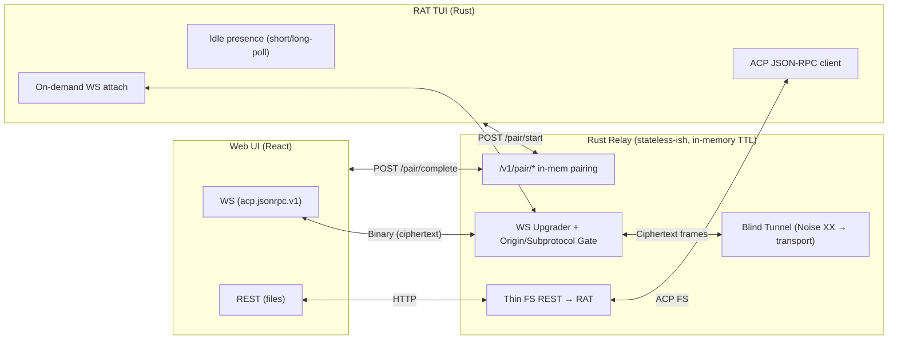
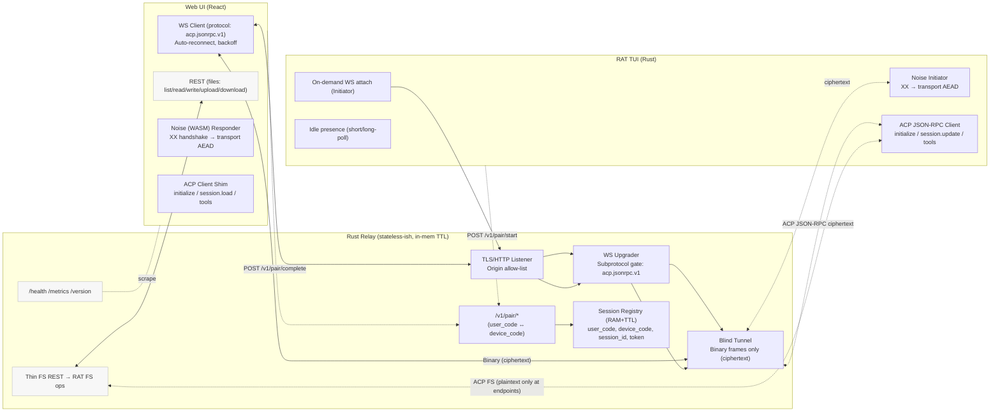

# Claude Code Web UI + E2E-Encrypted Relay + RAT TUI — Software Design Spec
This spec defines a hosted web UI connected to a user-run RAT TUI via an E2E-encrypted relay. It preserves ACP semantics end-to-end and minimizes server-side state while keeping legacy REST file endpoints for UX. [ACP Overview](https://agentclientprotocol.com/overview/introduction)

## 1) Goals & Non-Goals
- Goals: (a) seamless pairing via short code; (b) privacy by default (relay is a blind forwarder); (c) resumable sessions for mobile; (d) bounded infra footprint; (e) keep file REST endpoints for editor UX. [RFC 8628](https://www.rfc-editor.org/rfc/rfc8628)
- Non-Goals: relay persistence of chat history; agent orchestration in relay; long-lived sockets for idle agents. History replay uses ACP, not server storage. [ACP Protocol](https://agentclientprotocol.com/protocol/overview)

## 2) High-Level Architecture
- Browser UI ↔ (WSS, subprotocol `acp.jsonrpc.v1`, E2E cipher) ↔ Relay (blind WS forwarder + thin REST FS) ↔ RAT TUI (ACP client to local agent). [RFC 6455](https://www.rfc-editor.org/rfc/rfc6455)






Rationale: WS provides full-duplex streaming for ACP; REST is retained only for file operations that fit HTTP semantics (streaming/multipart). Pairing follows device-authorization UX. [RFC 6455](https://www.rfc-editor.org/rfc/rfc6455) [RFC 8628](https://www.rfc-editor.org/rfc/rfc8628) [HTTP Semantics](https://www.rfc-editor.org/rfc/rfc9110)

## 3) Trust & Threat Model
- Relay is honest-but-curious; must not learn ACP payloads. Browser↔RAT perform a Noise XX handshake inside WS and then use transport mode AEAD for all ACP JSON-RPC bytes. [Noise Protocol Framework](https://noiseprotocol.org/noise.html)
- Origin allow-list enforced at WS upgrade; subprotocol must be echoed; session tokens are short-lived and bound into the Noise transcript to prevent replay. [RFC 6455](https://www.rfc-editor.org/rfc/rfc6455)

## 4) Protocol Overview
### 4.1 Pairing (HTTP)
- RAT: `POST /v1/pair/start { rat_pubkey_b64, caps[], rat_version } → { user_code, device_code, relay_ws_url, expires_in }`. Show `user_code` to the user. [RFC 8628](https://www.rfc-editor.org/rfc/rfc8628)
- Browser: `POST /v1/pair/complete { user_code, browser_pubkey_b64 } → { session_id, session_token, relay_ws_url }`. [RFC 8628](https://www.rfc-editor.org/rfc/rfc8628)

### 4.2 Attachments (WS)
- RAT: `GET /v1/connect?device_code=...` with `Sec-WebSocket-Protocol: acp.jsonrpc.v1`. Browser: `GET /v1/connect?session_id=...&token=...` with same subprotocol. Server echoes subprotocol and validates `Origin`. [RFC 6455](https://www.rfc-editor.org/rfc/rfc6455)

### 4.3 End-to-End Crypto (Noise XX)
- Handshake: XX pattern (no prior static); transcript prologue includes `{session_id, session_token}`; switch to transport mode on success. All application bytes are WS Binary frames (opaque to relay). [Noise Protocol Framework](https://noiseprotocol.org/noise.html)

```json
// Key messages (shapes)

// 1) Pairing
POST /v1/pair/start
{ "rat_pubkey": "b64", "caps": ["acp","fs"], "rat_version": "x.y.z" }

POST /v1/pair/complete
{ "user_code": "ABC123", "browser_pubkey": "b64" }

// 2) WS attach (headers)
GET /v1/connect?device_code=...   // RAT
GET /v1/connect?session_id=...&token=...   // Browser
Sec-WebSocket-Protocol: acp.jsonrpc.v1
Origin: https://ui.example.com

// 3) ACP resume
{"jsonrpc":"2.0","id":1,"method":"initialize","params":{}}
{"jsonrpc":"2.0","id":2,"method":"session/load","params":{"sessionId":"sess_x"}}
```

### 4.4 ACP Tunneling
- After transport ready: carry ACP JSON-RPC unchanged (initialize → capability discovery; session messages; tool calls). For replay after reconnect, the browser calls `session/load` if advertised; agent replays via `session/update`. [ACP Protocol](https://agentclientprotocol.com/protocol/overview)

## 5) Component Responsibilities
### 5.1 Web UI (React)
- WS client (auto-reconnect + `acp.jsonrpc.v1`); Noise (WASM) responder; ACP client shim; file explorer that calls REST for list/read/write/upload/download/stat/search. [HTTP Semantics](https://www.rfc-editor.org/rfc/rfc9110)
- On reconnect: initialize → `session/load` → resume UI from streamed `session/update`. [ACP Overview](https://agentclientprotocol.com/overview/introduction)

### 5.2 Relay (Rust)
- HTTP: `/v1/pair/start`, `/v1/pair/complete`, `/health`, `/metrics`, `/version`, and file REST below. WS: upgrade gate (Origin, subprotocol), per-peer bounded channels, ping/pong, idle timeouts, blind relay of ciphertext frames. [RFC 6455](https://www.rfc-editor.org/rfc/rfc6455)
- In-memory TTL maps: user_code→device_code, device_code→device row, session_id→row{token, senders}. Periodic sweeper; no Redis. [RFC 8628](https://www.rfc-editor.org/rfc/rfc8628)

### 5.3 RAT TUI (Rust)
- Startup: pair/start, display code; idle presence via short-poll or long-poll; on attach trigger: WS connect (initiator), Noise handshake, then run ACP loop. [RFC 8628](https://www.rfc-editor.org/rfc/rfc8628)

## 6) REST Endpoints to Keep (thin FS layer)
- Keep:
  `GET /api/files?path=dir` (list),
  `GET /api/file-content?path=path` (small reads),
  `POST /api/save-file` (writes),
  `GET /api/markdown-files?path=dir` (filter),
  `POST /api/markdown-content` (batch reads). [HTTP Semantics](https://www.rfc-editor.org/rfc/rfc9110)
- Add (recommended):
  `POST /api/upload-file` (multipart), `GET /api/download?path=...` (stream), `POST /api/move-file`, `DELETE /api/file`, `GET /api/file-stat`, `GET /api/search?path=&q=`. [RFC 7578](https://www.rfc-editor.org/rfc/rfc7578)

## 7) State Machines (resilience & scale)
- Agent connection model: IDLE (no WS; polling) → ACTIVE (WS) → SUSPENDED (mobile dropped; fall back to IDLE). Only ACTIVE consumes WS. Browser reconnect calls `session/load`. [ACP Protocol](https://agentclientprotocol.com/protocol/overview)
- Backpressure: bounded mpsc per peer; close on overflow; exponential backoff on reconnect. [RFC 6455](https://www.rfc-editor.org/rfc/rfc6455)

```mermaid
classDiagram
  class PairRow {
    +user_code : string
    +device_code : string
    +exp_ts : instant
  }
  class DeviceRow {
    +device_code : string
    +rat_pubkey_b64 : string
    +caps : string[]
    +exp_ts : instant
  }
  class SessionRow {
    +session_id : string
    +device_code : string
    +token : string
    +created_ts : instant
    +rat_tx? : sender
    +web_tx? : sender
  }
  PairRow "1" --> "1" DeviceRow : resolves to
  DeviceRow "1" --> "0..1" SessionRow : may create
  ```

## 8) Message & Handshake Sketches

### 8.1 Pairing
- RAT → `/v1/pair/start` → `{ user_code, device_code, relay_ws_url }`; Browser → `/v1/pair/complete` → `{ session_id, session_token }`. [RFC 8628](https://www.rfc-editor.org/rfc/rfc8628)

```json
// Browser WS request (subprotocol + token conveyed via query param)
GET /v1/connect?session_id=sess_123&token=stk_abc HTTP/1.1
Sec-WebSocket-Protocol: acp.jsonrpc.v1
Origin: https://ui.example.com
```

Server MUST echo `Sec-WebSocket-Protocol: acp.jsonrpc.v1` in 101 response and enforce `Origin`. [RFC 6455](https://www.rfc-editor.org/rfc/rfc6455)

### 8.2 Noise (opaque framing)
- Browser/RAT exchange Noise XX handshake bytes as WS Binary frames; after transport, every ACP JSON-RPC message is AEAD ciphertext in Binary frames. Relay does not inspect. [Noise Protocol Framework](https://noiseprotocol.org/noise.html)

### 8.3 ACP replay
- On reconnect, Browser: `initialize` → check `agentCapabilities.loadSession` → `session/load { sessionId }` → handle streaming `session/update` until result. [ACP Overview](https://agentclientprotocol.com/overview/introduction)

## 9) Relay Data Model (in-mem)
- `user_codes`: user_code → { device_code, exp_ts }
- `devices`: device_code → { rat_pubkey, caps, exp_ts }
- `sessions`: session_id → { device_code, token, created_ts, rat_tx?, web_tx? }
- `pending_rat`: device_code → rat_tx (pre-browser attach)
Sweeper drops expired rows; metrics count active sessions, WS, bytes. [RFC 8628](https://www.rfc-editor.org/rfc/rfc8628)

## 10) Security Controls
- WSS only; strict Origin allow-list; subprotocol echo; single-use short-TTL session_token bound into Noise prologue; path allow-lists for FS; deny `..` and symlink escapes. [RFC 6455](https://www.rfc-editor.org/rfc/rfc6455) [HTTP Semantics](https://www.rfc-editor.org/rfc/rfc9110)
- Close on idle and on queue overflow; never log codes, tokens, keys, or plaintext payloads. [RFC 6455](https://www.rfc-editor.org/rfc/rfc6455)

## 11) Performance & Scale
- Steady state: most RATs in IDLE (HTTP poll every 3–30s). ACTIVE WS only for live users → bounded FD/TLS memory. [HTTP Semantics](https://www.rfc-editor.org/rfc/rfc9110)
- Upgrade paths: WS over H2 (coalesce TCP) or WebTransport over H3 to multiplex streams when browser support is ready. [RFC 8441](https://www.rfc-editor.org/rfc/rfc8441) [WebTransport](https://www.w3.org/TR/webtransport/)

## 12) Observability
- `/metrics` for Prometheus (active_sessions, ws_open, bytes_rx/tx, backpressure_closes, pairing_rate, replay_latency). Health/readiness endpoints for LBs. [HTTP Semantics](https://www.rfc-editor.org/rfc/rfc9110)

## 13) Implementation Plan (milestones)
1. Relay skeleton: pair/start, pair/complete, WS upgrade with Origin/subprotocol, in-mem TTL maps. [RFC 6455](https://www.rfc-editor.org/rfc/rfc6455)
2. Noise XX (Rust `snow` core + WASM in browser), binary framing, E2E echo test with golden vectors. [Noise Protocol Framework](https://noiseprotocol.org/noise.html)
3. ACP pass-through: initialize → prompt → tool calls; `session/load` replay. [ACP Protocol](https://agentclientprotocol.com/protocol/overview)
4. File REST (keep set + upload/download/stat/search) as thin proxies to RAT FS ACP. [HTTP Semantics](https://www.rfc-editor.org/rfc/rfc9110)
5. Scale guards: bounded queues, timeouts, metrics, error taxonomy, soak tests. [RFC 6455](https://www.rfc-editor.org/rfc/rfc6455)

## 14) Test Plan
- WS handshake (Origin, protocol), cipher opacity (relay never sees plaintext), replay correctness (`session/load`), FS path traversal denial, backpressure close, soak with 5k idle RATs + 500 ACTIVE. [ACP Overview](https://agentclientprotocol.com/overview/introduction) [RFC 6455](https://www.rfc-editor.org/rfc/rfc6455)

## 15) Open Flags (post-MVP)
- WebTransport/H3 pilot; DPoP-style sender-constrained tokens if we later expose additional REST APIs; optional P2P fast path (TURN/ICE) for large file sync. [WebTransport](https://www.w3.org/TR/webtransport/) [RFC 8441](https://www.rfc-editor.org/rfc/rfc8441)

```json
// Appendix A — Minimal REST to keep (exact shapes)
GET  /api/files?path={directory_path}
GET  /api/file-content?path={file_path}
POST /api/save-file
GET  /api/markdown-files?path={directory_path}
POST /api/markdown-content
// Recommended additions
POST /api/upload-file           // multipart
GET  /api/download?path=...
POST /api/move-file
DELETE /api/file
GET  /api/file-stat
GET  /api/search?path=...&q=...
```

These REST calls exist for UX and streaming efficiency; all chat/session/tool semantics live on the E2E WS ACP tunnel. [HTTP Semantics](https://www.rfc-editor.org/rfc/rfc9110) [ACP Protocol](https://agentclientprotocol.com/protocol/overview)

# Acceptance Criteria
- Pairing end-to-end in <2s median; WS attaches with echoed subprotocol and allowed Origin only; ACP payloads fully opaque to relay; browser reconnection yields deterministic replay via `session/load`; file REST verified against path policy with streaming/multipart support. [RFC 6455](https://www.rfc-editor.org/rfc/rfc6455) [ACP Overview](https://agentclientprotocol.com/overview/introduction) [RFC 7578](https://www.rfc-editor.org/rfc/rfc7578)

# Deployment Notes
- Single binary relay behind LB with sticky routing by session_id/device_code; horizontal scale by shard; no external datastore required. [HTTP Semantics](https://www.rfc-editor.org/rfc/rfc9110)
